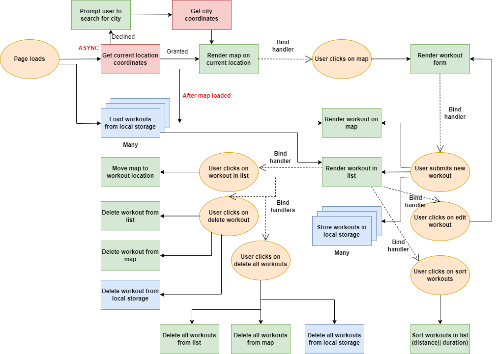

This project was primarily developed during a JavaScript course I took with [Jonas Schmedtmann](https://twitter.com/jonasschmedtman). He designed the project and I coded along with him during the course. Figure 1 shows the flowchart of what exactly was developed during the course.

<figure>
  
  <figure-caption>
    
<i>Figure 1. The Course Project Flowchart (developed by Jonas).</i>

  </figure-caption>
</figure>

After the course, I decided to take the project a few steps further and add the following functionalities myself:
1. edit a workout
2. delete a workout
3. delete all workouts
4. sort workouts by certain fields (distance or duration)
<!-- 5. rebuild running and cycling objects coming from local storage -->
<!-- 6. better error and confirmation messages -->
<!-- 7. ability to position map to view all workouts (important) -->
<!-- 8. ability to draw lines and shapes, instead of points -->
<!-- 9. geocode location from coordinates and use it in workout description ("run in Toronto, Canada") -->
<!-- 10. display weather data for workout time and place -->
<!-- 11. add city search input in case location was not granted -->
<!-- 12. ability to delete/cancel forms -->

Figrure 2 shows the flowchart of the complete functionalities developed by Jonas and myself.
<figure>
  
  <figure-caption>
    
<i>Figure 2. The Complete Project Flowchart.</i>

  </figure-caption>
</figure>

To compare between the course project and my updated version of the project, please go to the following links:
[Course project](https://mapty.netlify.app/) vs [My updated project]()

TODO:
- create a complete architecture 
